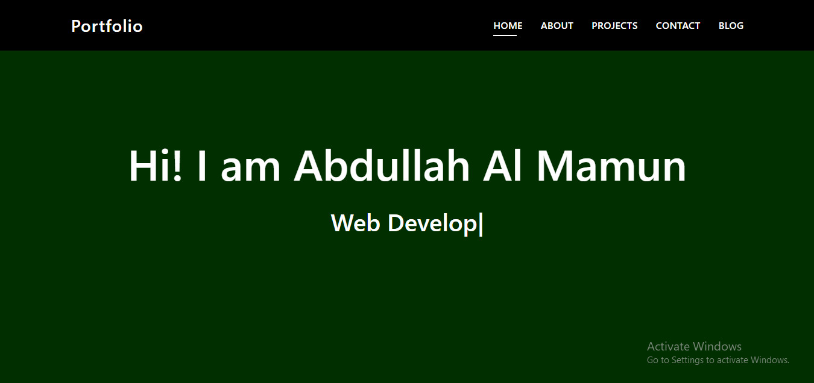
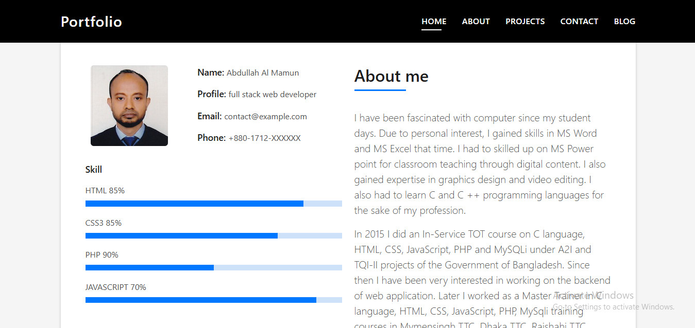
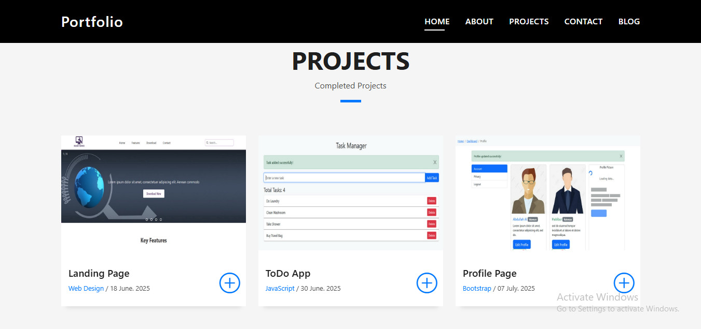
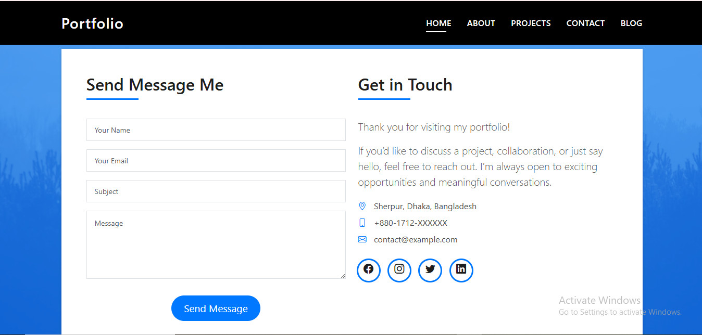
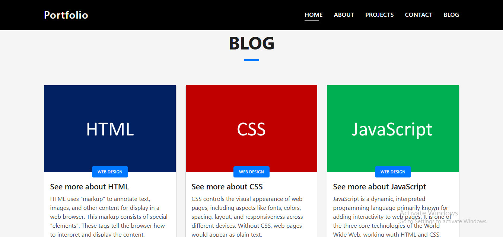

# Module 14 Peoject : Laravel Portfolio Website

This is a simple **Portfolio Website** built with **Laravel 12** and **Bootstrap 5.3**. It demonstrates a basic web development agency website with multiple pages and static content.

## Features

- Home page with a welcome message and agency introduction.
- About page with a short bio of a web developer.
- Projects page displaying 6 static projects.
- Contact page with a simple form (no backend submission).
- Blog page containing 6 static blog posts.
- Responsive design using Bootstrap 5.

## Project Structure

> app/Http/Controllers/PortfolioController.php
> resources/views/layout/layout.blade.php
> resources/views/portfolio/home.blade.php
> resources/views/portfolio/about.blade.php
> resources/views/portfolio/projects.blade.php
> resources/views/portfolio/contact.blade.php
> resources/views/portfolio/blog.blade.php
> routes/web.php

## Webpage Screenshot

> 

> 

> 

> 

> 

## How to Use
1. Clone the repository
2. Install dependencies
3. Serve the application (php artisan serve)
4. Open your browser and visit http://127.0.0.1:8000

